# Diagramas Mermaid - Mi Boda App

> Estos diagramas pueden visualizarse en GitHub, VS Code con extensión Mermaid, o en [mermaid.live](https://mermaid.live)

---

## 1. Arquitectura de Alto Nivel

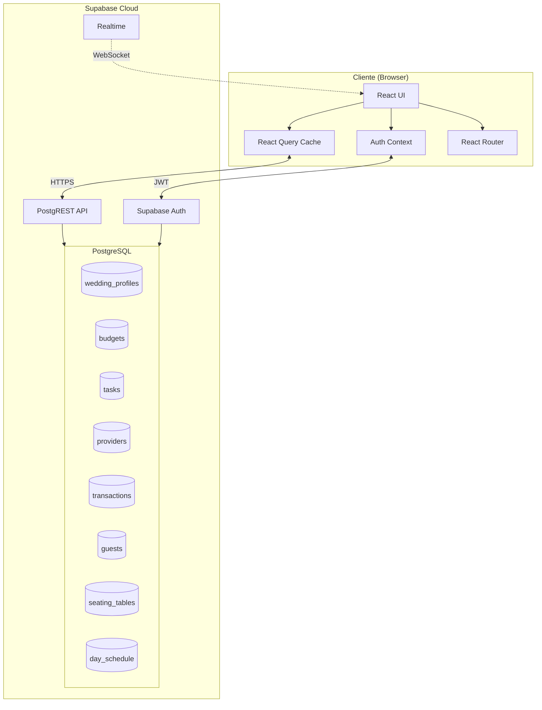

---

## 2. Diagrama de Componentes

```mermaid
flowchart TB
    subgraph Entry["Entry Point"]
        main[main.tsx]
    end

    subgraph App["App.tsx"]
        QCP[QueryClientProvider]
        AP[AuthProvider]
        BR[BrowserRouter]
        T[Toaster]
    end

    subgraph Routes["Rutas"]
        AUTH[/auth]
        OB[/onboarding]
        PR_ROUTE[ProtectedRoute]
        OR_ROUTE[OnboardingRoute]
    end

    subgraph Layout["AppLayout"]
        BN[BottomNavigation]
        OUTLET[Outlet]
    end

    subgraph Pages["Páginas"]
        DASH[Dashboard]
        BUDGET[Budget]
        TASKS[Tasks]
        PROV[Providers]
        MYDAY[MyDay]
    end

    main --> App
    QCP --> AP
    AP --> BR
    BR --> AUTH
    BR --> PR_ROUTE
    PR_ROUTE --> OB
    PR_ROUTE --> OR_ROUTE
    OR_ROUTE --> Layout
    Layout --> BN
    Layout --> OUTLET
    OUTLET --> DASH
    OUTLET --> BUDGET
    OUTLET --> TASKS
    OUTLET --> PROV
    OUTLET --> MYDAY
```

---

## 3. Modelo de Datos (ERD)

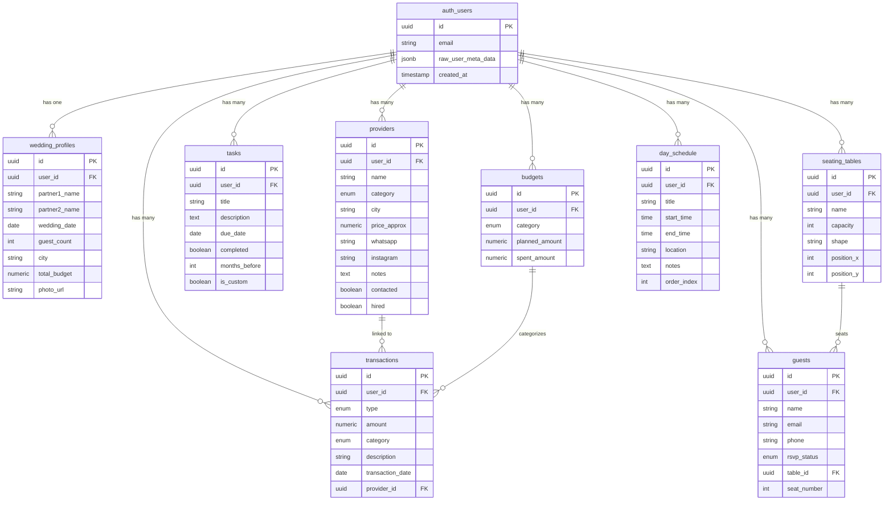

---

## 4. Flujo de Autenticación

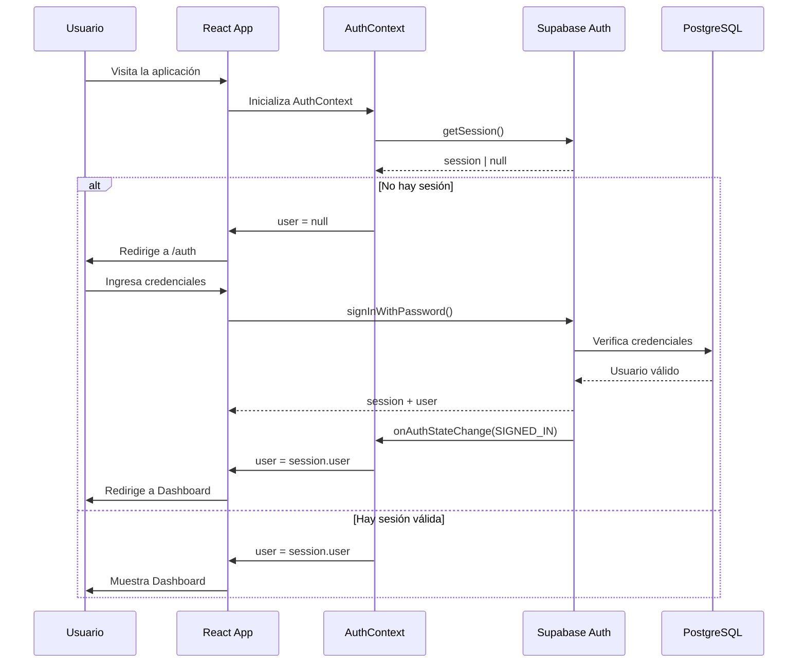

---

## 5. Flujo de Onboarding

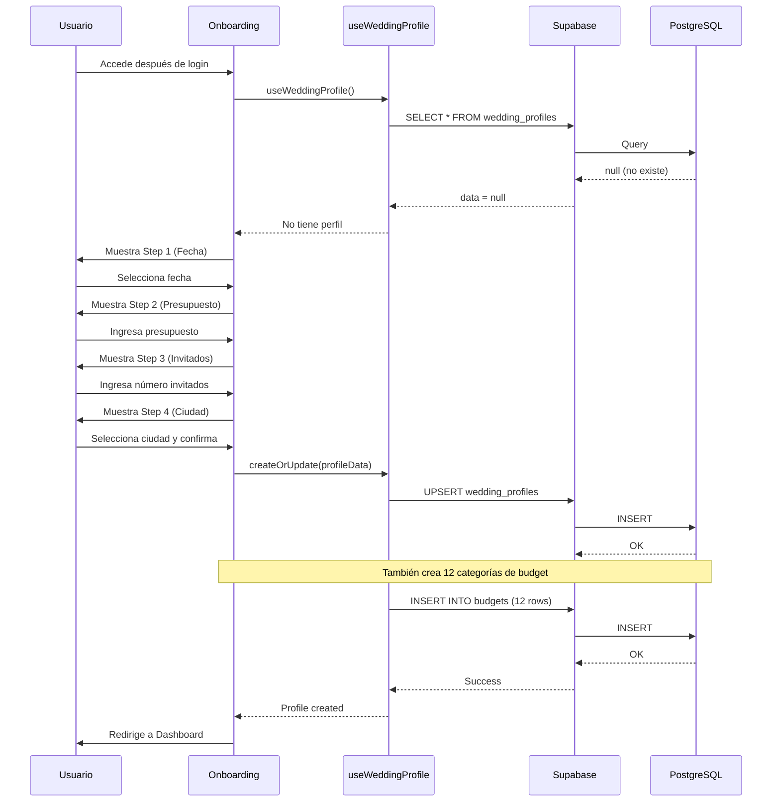

---

## 6. Flujo CRUD - Presupuesto

```mermaid
flowchart TD
    subgraph Usuario
        A[Abre página Budget]
    end

    subgraph ReactQuery["React Query"]
        B[useBudgets]
        C[useTransactions]
        D[useAddTransaction]
    end

    subgraph Supabase
        E[PostgREST API]
        F[(PostgreSQL)]
    end

    A --> B
    A --> C
    B -->|SELECT| E
    C -->|SELECT| E
    E --> F
    F -->|budgets[]| E
    F -->|transactions[]| E
    E -->|data| B
    E -->|data| C
    B -->|render| G[Mostrar categorías]
    C -->|render| H[Mostrar historial]

    I[Usuario agrega gasto] --> D
    D -->|INSERT transaction| E
    E --> F
    F -->|OK| E
    E -->|success| D
    D -->|invalidate| B
    D -->|invalidate| C
    B -->|refetch| E
    C -->|refetch| E
```

---

## 7. Flujo CRUD - Tareas

```mermaid
flowchart LR
    subgraph Lectura
        A1[useTasks] -->|SELECT| B1[API]
        B1 --> C1[(DB)]
        C1 -->|tasks[]| B1
        B1 -->|cache| A1
    end

    subgraph Crear
        A2[useAddTask] -->|INSERT| B2[API]
        B2 --> C2[(DB)]
        C2 -->|OK| B2
        B2 -->|invalidate| A1
    end

    subgraph Toggle
        A3[useToggleTask] -->|UPDATE| B3[API]
        B3 --> C3[(DB)]
        C3 -->|OK| B3
        B3 -->|invalidate| A1
    end

    subgraph Eliminar
        A4[useDeleteTask] -->|DELETE| B4[API]
        B4 --> C4[(DB)]
        C4 -->|OK| B4
        B4 -->|invalidate| A1
    end
```

---

## 8. Flujo CRUD - Proveedores

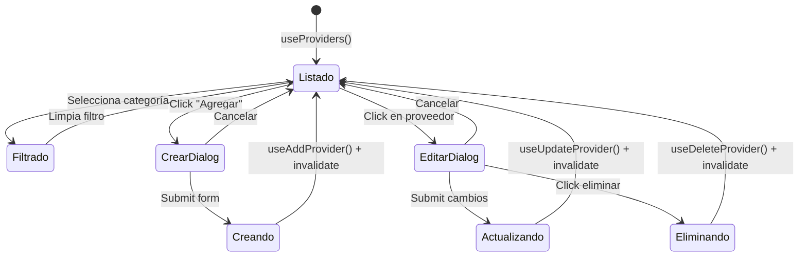

---

## 9. Estados de la Aplicación

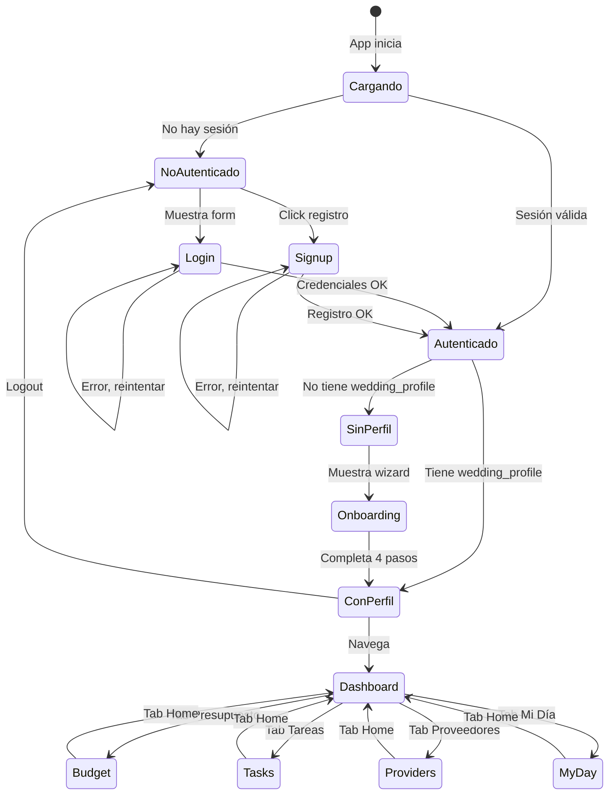

---

## 10. Arquitectura de Hooks

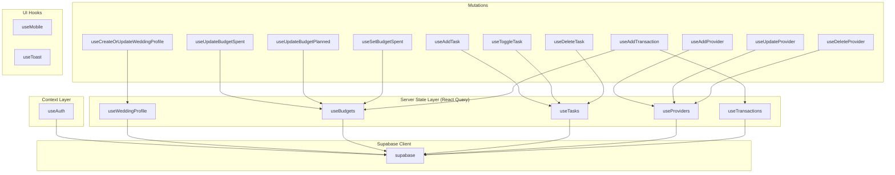

---

## 11. Navegación de la App

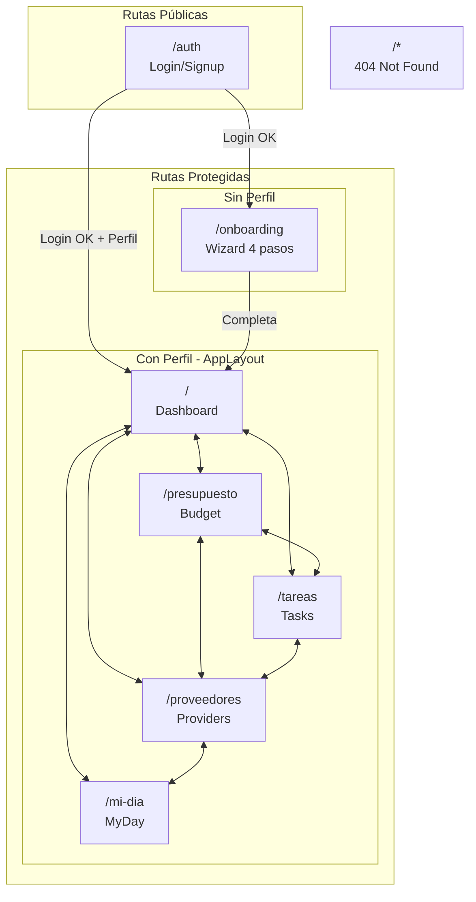

---

## 12. Ciclo de Vida de una Transacción

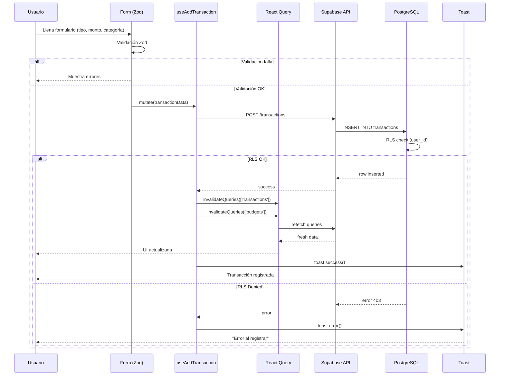

---

## 13. Estructura de Componentes UI (shadcn/ui)

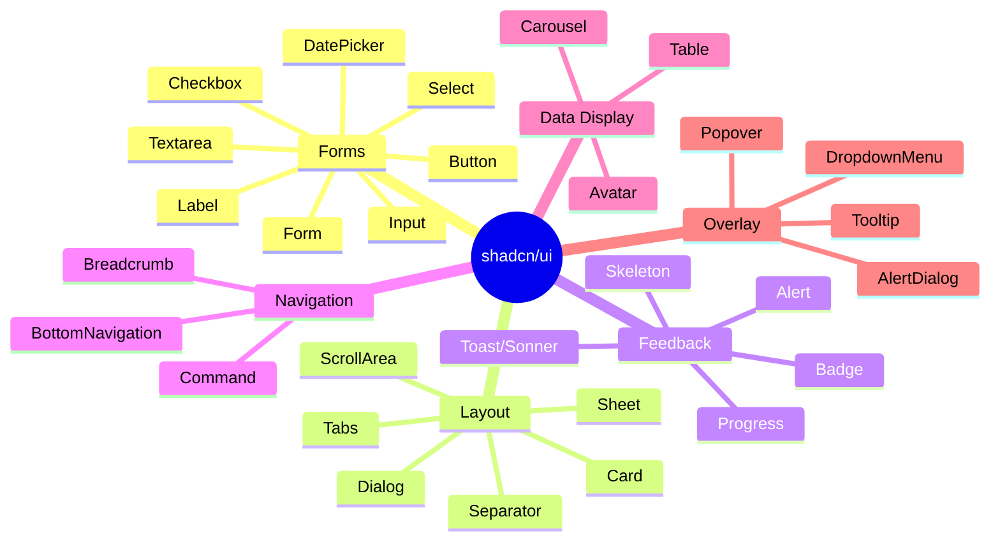

---

## 14. Categorías de Presupuesto

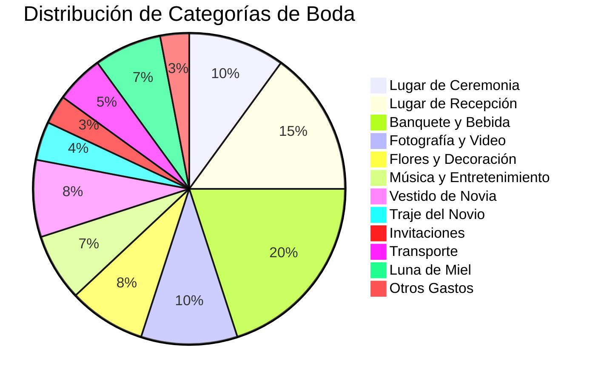

---

## 15. Timeline del Onboarding

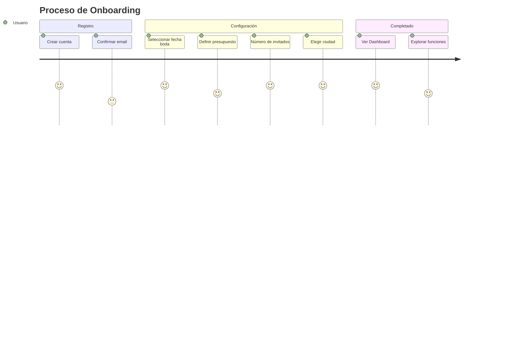

---

## 16. Seguridad - Row Level Security

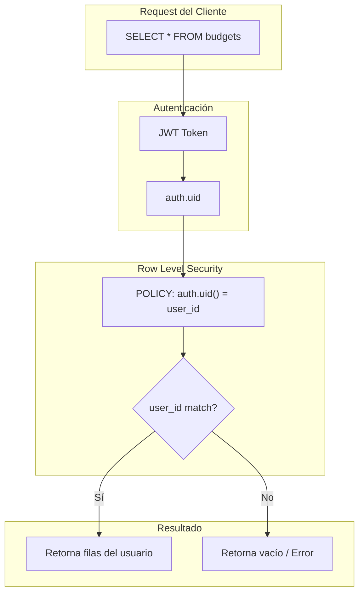

---

## 17. Stack Tecnológico Visual

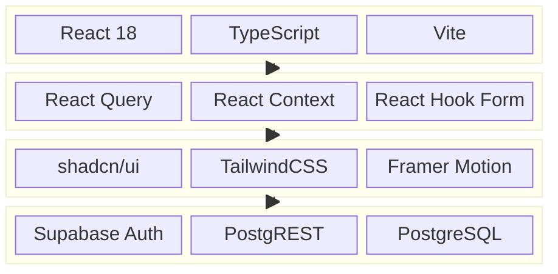

---

## Cómo Visualizar Estos Diagramas

1. **GitHub**: Copia este archivo a un repo de GitHub, los diagramas se renderizan automáticamente.

2. **VS Code**: Instala la extensión "Markdown Preview Mermaid Support"

3. **Online**: Ve a [mermaid.live](https://mermaid.live) y pega cualquier bloque de código Mermaid

4. **Notion**: Soporta bloques de código Mermaid nativamente

5. **Obsidian**: Soporta Mermaid con el plugin de preview

---

*Diagramas generados para Mi Boda App*
